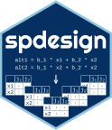

<!-- README.md is generated from README.Rmd. Please edit that file -->

# spdesign: Designing Stated Preference Experiments

# spdesign <a href="https://spdesign.edsandorf.me"></a>

<!-- badges: start -->

[](https://cran.r-project.org/package=spdesign)
[](http://www.r-pkg.org/pkg/spdesign)
[](https://github.com/edsandorf/spdesign/actions?workflow=R-CMD-check)
[](https://codecov.io/github/edsandorf/spdesign?branch=master)
<!-- badges: end -->

Contemporary software commonly used to design stated preference
experiments are expensive and the code is closed source. `spdesign` is a
free software package with an easy to use interface to make flexible
stated preference experimental designs using state-of-the-art methods.

## Installation

The package can be installed from CRAN.

``` r
install.packages("spdesign")
```

A development version of the package can be installed from Github.
Remember to select the most recent development version (check the
available branches).

``` r
devtools::install_github("edsandorf/spdesign")
```

## Example

This is a basic example which shows you how to solve a common problem:

``` r
library(spdesign)

#' Specifying a utility function with 3 attributes and a constant for the
#' SQ alternative. The design has 20 rows.
utility <- list(
  alt1 = "b_x1[0.1]  * x1[1:5] + b_x2[0.4] * x2[c(0, 1)] + b_x3[-0.2] * x3[seq(0, 1, 0.25)]",
  alt2 = "b_x1       * x1      + b_x2      * x2          + b_x3       * x3",
  alt3 = "b_sq[0.15] * sq[1]"
)

# Generate designs ----
design <- generate_design(utility,
                          rows = 20,
                          model = "mnl", 
                          efficiency_criteria = "d-error",
                          algorithm = "rsc")

# Add a blocking variable to the design with 4 blocks.
design <- block(design, 2)


summary(design)
```

## Bugs and error reporting

All software contains bugs and we would very much like to find these and
root them out. If you find a bug or get an error message, please reach
out so that we can try and improve the software.

## Acknowledgements

We are grateful to Petr Mariel, Jürgen Meyerhoff and Ainhoa Vega for
providing feedback and extensive testing of the package. We also thank
participants in the 2022 Summer School “Valuing options of adaption to
climate change using choice experiments” at the University of Cape Town
for valuable feedback on a beta version of the package. The package
comes with no warranty and the authors cannot be held liable for errors
or mistakes resulting from use. The authors acknowledge funding from the
European Union’s Horizon 2020 research and innovation program under the
Marie Sklodowska-Curie grant INSPiRE (Grant agreement ID: 793163).
